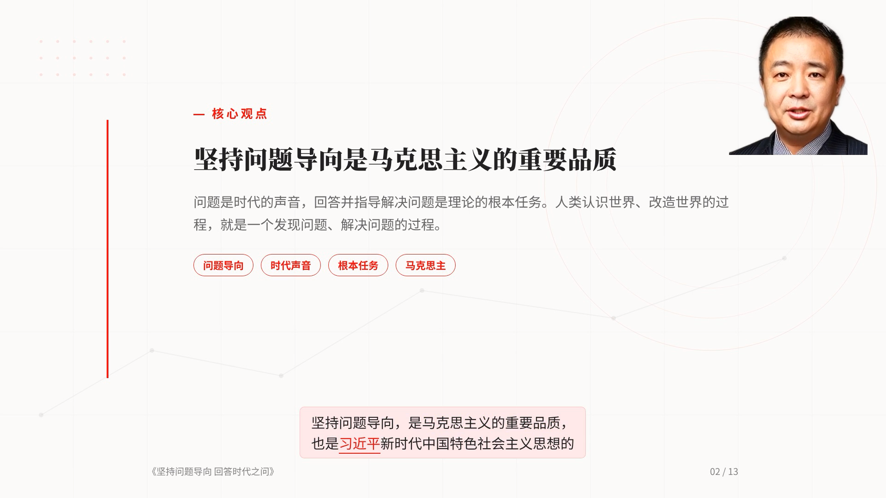
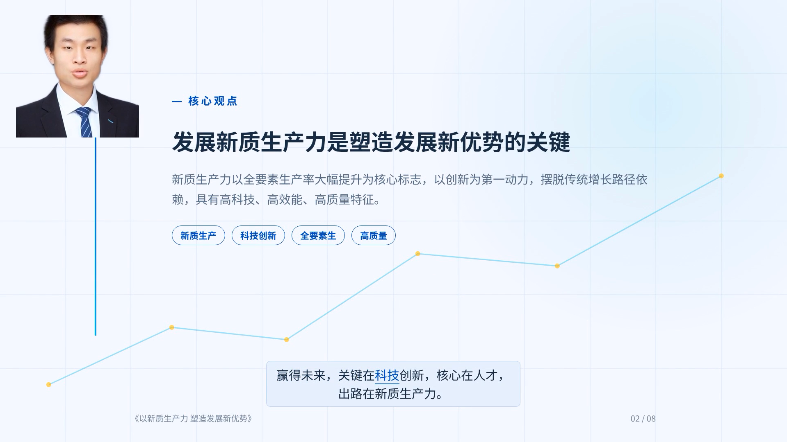

<!-- prettier-ignore -->
<div align="center">


# 理论文章转视频(Theory-to-Video)

*把一篇理论长文,自动变成一条庄重的政论视频 —— PPT 式成片 + 数字人播报视频*

[](https://www.python.org)
[](https://nodejs.org)
[](https://fastapi.tiangolo.com)
[](https://developer.nvidia.com/cuda-toolkit)


[效果展示](#效果展示) • [功能特性](#功能特性) • [工作原理](#工作原理) • [快速开始](#快速开始) • [使用流程](#使用流程) • [配置](#配置) • [项目结构](#项目结构) • [已知限制](#已知限制) • [相关文档](#相关文档)

</div>

上传一篇人民日报「人民要论」、马院论文这类理论长文,选好风格与时长,系统会用大模型生成逐帧解说脚本、本地配音、浏览器渲染,产出一条 1080p 的 PPT 式政论视频;需要时还能让数字人出镜播报。**前端、后端、配音全部跑在本机**,只有文本分析走 OpenAI 兼容的 DeepSeek 网关。

| 入口 | 地址 |
|---|---|
| 本地默认 | `http://localhost:8015/`(接口文档 `/docs`) |
| 生产部署 | `http://8.130.213.80:20013/ttv/`(nginx `/ttv/` 子路径) |

## 效果展示

两条真实成片的截图(1080p),同一套流水线换一张脸就是另一个数字人:

<p align="center">
  
  <br /><em>内置形象「金立」出镜</em>
</p>

<p align="center">
  
  <br /><em>上传形象「韦东奕」出镜 —— 在「数字人形象」页上传并设为默认,重新构建即换人</em>
</p>

## 功能特性

- **两种视频类型,同一套流水线** —— *宣传视频*提炼主旨、归档宣传(30 秒 - 10 分钟);*讲解视频*老师逐段精讲、拆解写法(5 - 30 分钟,每 5 分钟一档)。
- **一条台词驱动全部轨道** —— 每帧的 `voiceover` 是唯一来源:既是配音文本、也是底部字幕、还是数字人念的内容。
- **四维度风格系统** —— 字体 × 配色 × 背景 × 动效自由组合,另有三套经典预设;新增样式只需往注册表加一条。
- **本地配音,零调用成本** —— CosyVoice3 多实例(--gpus 多卡并行)零样本克隆三种音色,自然语速 1.0,配音结果按指纹复用。
- **数字人出镜(可选)** —— 成片里叠一个数字人朗读当前帧台词,四角任选(默认右上)、大小可手输(默认 300×300),也能一键切成**纯 PPT 版**;默认开启「**只保留人像(背景透明)**」—— 背景抠掉再叠上去,幻灯片内容从人像四周透出来(角落照旧四选一;下排默认贴画面下缘)。
- **数字人抠像(本地推理)** —— 每段片段旁多一条灰度遮罩(MODNet ONNX,Apache-2.0,25MB),叠加时 `alphamerge` 合成;片段与遮罩各自缓存、各自失效,抠像不可用时逐条回退圆角卡片,成片照出。
- **数字人形象库** —— 网页上传/管理多张形象(png / jpg / webp ≤20MB,同一张图重复上传自动去重),点一下「设为默认」即换脸:不用改代码、不用重启服务;换形象只影响**后续构建**,已出片的老任务不受影响。
- **数字人播报视频(独立支线)** —— 分析完即可一键生成一条纯人像口播片(含完整配音音轨、不含 PPT 画面),不依赖成片渲染。
- **一键出片** —— 分析完成后一个按钮跑完「构建 → 渲染」:中途不停在预览态、不等你点第二次,也不拉起用不到的 Studio 编辑器;想先改时间线仍可走「构建预览 → 渲染成片」两步。
- **Studio 编辑器构建即就绪** —— 构建预览完成时编辑器已同步拉起,进入页面即可改时间线、逐帧编辑、实时预览。
- **项目历史入口页** —— 打开站点先看到历史项目(按最近更新倒序):每步结果都留档、可重命名、可直达;大模型自动总结项目标题,也能手动改。渲染很花时间,关掉页面回来接着看就行。
- **网页「设置」页** —— 顶栏入口,把「分析服务地址与密钥」「成片保存位置」这类**只有使用者自己能定**的东西搬到网页上:保存即生效、不用改环境变量、不用重启;带「测试连接」当场验证网关,密钥只回掩码不回明文。面向不懂服务器的使用者,不出现任何技术名词。
- **质量门 + 「永不失败」管线** —— 引文逐字接地校验、段级确定性修复、脚本疑似问题兜底放行;文字类问题绝不中断工作流。
- **并发与健壮性** —— 全局 LLM 并发 6、渲染并发 2、任务状态持久化重启恢复、冒烟回归测试覆盖纯函数与接口契约。

## 工作原理

```text
文章(txt / md / docx ≤20MB,或粘贴文字)
  └─ 分析(DeepSeek 兼容网关)
       ├─ 宣传:两阶段 —— 论证诊断(论点/论证链/数据/金句/帧计划)→ 按帧计划生成脚本
       └─ 讲解:两步 —— 备课方案(章节/逐段要点/待批注句)→ 按章节分段并行生成脚本
  └─ 构建预览(CosyVoice3 多实例并行配音 → 二次拓展内容 → 组装 HyperFrames 工程 → 同步拉起 Studio)
       ├─ 数字人片段(出镜时):用形象库「当前默认」那张脸,每次构建时解析 —— 换形象不必重启
       ├─ 渲染成片:1080p PPT 视频 [→ 数字人片段按时间轴叠加到指定角落]
       └─ 数字人播报视频(支线,不经过 HyperFrames):逐帧片段顺序拼接 + 合流音轨
  └─ 一键出片(构建 + 渲染一次触发:不拉 Studio、不停在预览态,`POST /render {"build":true}`)
```

任务是磁盘持久化的状态机:`uploaded → analyzing → analyzed → building → preview → rendering → rendered`;一键出片走同一套状态(`building → rendering → rendered`,只是不经过 `preview` 这一站),播报视频走支线状态 `avatar_building`,成功或失败都回到进入前的状态,**失败不阻塞出片**。架构细节、关键设计决策与完整接口清单见 [`ARCHITECTURE.md`](ARCHITECTURE.md)。

## 快速开始

### 环境要求

| 项 | 要求 | 本机实测 |
|---|---|---|
| 系统 | Linux x86_64(Ubuntu 22.04) | Ubuntu 22.04 |
| GPU | NVIDIA,显存 ≥16GB(配音/数字人需要) | RTX 5090 32GB(sm_120) |
| 驱动 / CUDA | 支持 torch 2.8+ | 595.58.03 / CUDA 12.8 |
| Node.js | 22(hyperframes CLI 用) | v22.20.0 |
| Python | 3.10+(后端;配音用系统 3.10) | 3.10.12 / 主 venv 3.12.14 |
| 其它 | `ffmpeg` / `ffprobe`、`curl`、`npm` | ffmpeg 4.4.2 |
| 磁盘 | 仅 PPT 主线 ≥30GB;含数字人 ≥100GB | — |
| 网络 | 能访问 DeepSeek 兼容网关(见[配置](#配置)) | — |

### 1. 获取代码与主站依赖

仓库只跟踪源码与文档:模型权重、字体、venv、上传的数字人形象等运行时数据全部不入库(`.gitignore`)。

```bash
git clone git@github.com:Ironstarboy/article2video.git
cd article2video

python3 -m venv .venv && .venv/bin/pip install -r server/requirements.txt

# 一次性准备:完整版字体 + BGM + gsap + hyperframes CLI + 无头 Chrome + 抠像权重(MODNet 25MB)[+ nginx 路由]
bash deploy/setup.sh
```

`setup.sh` 会下载完整版 OTF 字体(并校验 ≥10MB,子集版会把生僻字渲染成方框)、CC0 占位 BGM(缺失时生成静音占位)、GSAP、`hyperframes@0.8.15` 与 `chrome-headless-shell`、**数字人抠像权重** `models/matte/modnet.onnx`(MODNet,Apache-2.0,25MB;走 hf-mirror,失败只警告——抠像不可用时成片自动回退圆角卡片),可选安装 nginx 路由。抠像还要求跑它的解释器里有 `onnxruntime`(`setup.sh` 会尽力装进 `tts-venv`)。

### 2. 配置分析端点

写入 `.secrets/llm.env`(`deploy/start.sh` 自动加载):

```bash
# 方案 A:本机/内网 vLLM(默认值,零成本)
TTV_DEEPSEEK_URL=http://8.130.213.80:20001/v1
TTV_DEEPSEEK_MODEL=DeepSeek-V4-Flash

# 方案 B:云上 OpenAI 兼容网关
TTV_DEEPSEEK_URL=https://llmapi.paratera.com/v1
TTV_DEEPSEEK_MODEL=DeepSeek-V4-Flash
TTV_DEEPSEEK_KEY=sk-...
```

### 3. 装本地配音(CosyVoice3)

```bash
# 权重(ModelScope;HuggingFace 在部分网络下不通)
python3 -c "from modelscope import snapshot_download; snapshot_download('FunAudioLLM/Fun-CosyVoice3-0.5B-2512', local_dir='models/CosyVoice3-0.5B')"

# 源码(需取 Matcha-TTS 子模块)
git clone --depth 1 https://github.com/FunAudioLLM/CosyVoice.git cosyvoice-src
(cd cosyvoice-src && git submodule update --init)

# 运行时(复用系统 torch,只挑与推理正确性相关的两项钉版)
python3.10 -m venv --system-site-packages tts-venv
tts-venv/bin/pip install modelscope wetext sentencepiece hydra-core HyperPyYAML \
  omegaconf librosa soundfile inflect pyworld conformer gdown wget lightning
tts-venv/bin/pip install "transformers==4.51.3" "tokenizers==0.21.4"
```

> [!WARNING]
> `transformers==4.51.3` / `tokenizers==0.21.4` **不能改**。语音 LLM 跑在 Qwen2 backbone 上,4.52+ 会让 speech token 序列乱掉:听感是「读音完全不正常、断断续续」,而**时长与峰值全正常**(时长/静音验收拦不住)。`tts_server` 启动时会硬校验版本(不符即拒启,`TTV_TTS_ALLOW_UNPINNED=1` 仅排障时用)。

三个零样本种子音色 `models/CosyVoice3-0.5B/asset-v2/{male,female,male_narrator}.wav` 上游没有,必须从已有环境拷贝(约 1MB)。

### 4. 装数字人(可选)

只有选「数字人出镜」的任务需要。源码 [CyberVerse](https://github.com/dsd2077/CyberVerse) 与权重 [Soul-AILab/SoulX-FlashHead-1_3B](https://modelscope.cn/models/Soul-AILab/SoulX-FlashHead-1_3B)(14GB)、音频编码器 `facebook/wav2vec2-base-960h` 分别落在 `CyberVerse-main/` 与 `CyberVerse-main/checkpoints/`。完整步骤(系统依赖、离线 wheel、protobuf 生成、踩坑速查)见 [`CyberVerse-DEPLOY-GPU.md`](CyberVerse-DEPLOY-GPU.md)。默认形象是随仓库分发的 `assets/avatars/jinli.png`,之后在网页「数字人形象」页随时上传、设为默认。

### 5. 启动与自检

```bash
# 一键启动 / 管理全栈(数字人 50051 + 配音 8016 + 后端与网页 8015)
bash deploy/start-all.sh               # 起全栈;已在跑的**自动跳过**(可反复执行,补起缺的那个即可)
bash deploy/start-all.sh status        # 看状态:端口 / 就绪度 / 各自 pid / GPU / 任务数
bash deploy/start-all.sh logs          # 跟踪三份日志(Ctrl+C 只退出查看,不停服务)
bash deploy/start-all.sh restart       # 强制全部重启(等价 start --force)
bash deploy/start-all.sh stop          # 停全栈(终端下问一次;脚本里加 --yes 跳过)
bash deploy/start-all.sh --no-avatar   # 只起后端 + 配音(纯 PPT 视频够用,省掉数字人 3-6 分钟预热)
bash deploy/start-all.sh --no-wait     # 只负责拉起,不在前台等就绪

# 或分步启动(单服务粒度;注意这三个会先 pkill 旧进程,后端重启会打断进行中的任务)
bash deploy/start-avatar.sh   # 数字人 gRPC 50051(首次 3-6 分钟:载权重 + torch.compile)
bash deploy/start-tts.sh      # CosyVoice3 8016(多实例见 TTV_TTS_GPUS / TTV_TTS_PORTS)
bash deploy/start.sh          # 后端与网页 8015
bash deploy/start-tts-qwen.sh # 备用引擎 Qwen3-TTS 8017(默认不启)
```

```bash
curl -s http://127.0.0.1:8015/health          # 后端
curl -s http://127.0.0.1:8016/health          # 配音(回报钉版版本)
.venv/bin/python server/smoke_test.py         # 冒烟回归(须用 .venv 解释器,系统 python3 缺 httpx)
node tests/avatar-page.test.js                # 前端页面逻辑回归(形象页 / 设置页,无 npm 依赖,仓库根直接跑)
```

> [!TIP]
> `deploy/start-all.sh` 默认**跳过已在跑的服务** —— 三个服务互相独立,少哪个补哪个,不会"起了这个丢了那个",也不会打断进行中的任务;真要重启用 `restart`。就绪判定是**真探活**:后端/配音走 `/health`,数字人走 gRPC(端口开了 != 模型就绪)。常用环境变量:`TTV_PORT`(8015)、`TTV_TTS_PORTS`(`"8016"` 或 `"8016 8018 8019"`)、`TTV_AVATAR_ADDR`。

## 使用流程

0. **进入项目历史页**:打开站点就是历史项目列表(按最近更新倒序),每条显示标题、当前状态/阶段进度与「分析脚本 → 构建预览 → 渲染成片 → 播报视频」四个步骤胶囊(**点任意一步直达那一步的结果**)。标题由大模型在分析完成后自动总结,可随时就地重命名;点「＋ 新建视频」进入创作页。顶栏另有两个二级页:「**数字人形象**」(见第 4 步)与「**设置**」(填分析服务与成片保存位置,保存即生效、一遍设好就不用再管)。
1. **上传文章**(txt / md / docx ≤20MB)或**粘贴文字**(≥50 字)。
2. **选风格与视频类型**:三套预设或四维自由组合;宣传/讲解共用一个时长滑杆,切换类型自动换档。
3. **开始分析**:调用 DeepSeek 网关。讲解视频为多轮调用(30 分钟档约 6-8 次),耗时 5-15 分钟属正常,页面显示阶段进度;分析完可就地「**编辑脚本**」逐帧改,或用一句话「**AI 按建议修改**」让模型按意见修订(保存前跑同一套校验,不达标会被拦下)。
4. **换数字人形象(可选)**:顶栏「**数字人形象**」(`?avatars=1`)上传图片、设为默认,并在同一页开关「**新任务默认抠掉背景**」(出厂开)。换形象 / 改偏好都不用重启,但要对任务**重新构建**才用得上新形象 —— 已出片的老任务不会自动变脸。
5. **数字人播报视频(可选)**:分析完成后即可一键生成,不需先构建、也不等成片;按「合成配音 → 生成片段 → 拼接」三步展示进度与预计剩余,完成后独立播放、下载。
6. **一键出片(推荐)**:分析完成后一个按钮跑完「构建 → 渲染」—— 多实例并行合成配音(旁白量不足目标时自动二次拓展内容)、组装 HyperFrames 工程、1080p 高清渲染(约 5-20 分钟,视时长),完成后就地播放与下载;渲染结束自动叠加上数字人(若已开启)。这条路**不拉起 Studio 编辑器、也不停在预览态等你点第二次**。
7. **想先调时间线就走两步**:「构建预览」组装工程并同步拉起 Studio 编辑器(改时间线 / 逐帧编辑 / 实时预览),满意后再点「渲染成片」。
8. 数字人几何(出镜开关 / 角落 / 大小 / **是否抠像**)在预览页随时可改,改完需**重新构建 + 重新渲染**才生效 —— 再点一次「一键出片」就是重跑这一整条。
9. **随时回来**:每一步(分析 / 构建 / 渲染 / 播报)完成或失败都会记进项目历史;从入口页点某一步即回到对应结果,正在进行的任务在列表上就能看到进度。

> [!NOTE]
> 时长靠内容充实度填:每帧 2-4 句旁白、画面元素填满上限、配音恒为自然语速 1.0 —— 长文短时自动压缩,短文长时逐层展开,不靠降速或静默凑时长。

### 视频类型

| 类型 | 定位 | 时长 | 分析方式 |
|---|---|---|---|
| **宣传视频** | 提炼主旨、归档宣传的政论宣传片(钩子 → 论点 → 是什么/为什么/怎么办 → 收束署名) | 30 秒 - 10 分钟 | 两阶段:论证诊断 → 按帧计划生成脚本 |
| **讲解视频** | 老师逐段精讲,像讲作文一样拆解段意、作用、写法与可迁移点 | 5 - 30 分钟(5 分钟一档) | 两步:备课方案 → 按章节分段并行生成 |

讲解视频另有三类专用画面:**原文段页**(textblock)、**逐句批注页**(annotation,原句 + 论点/论据/分析/对策/过渡/金句彩色标注)、**写法提炼页**(method,可迁移板书卡片);引用的原句必须逐字摘自原文,校验门硬拦截改写与编造。

### 风格系统

| 维度 | 选项 |
|---|---|
| 字体 | 宋体标题 + 黑体正文(庄重)/ 全宋体(学术)/ 全黑体(现代) |
| 配色 | 中国红(政论)/ 黛青墨韵(学术)/ 科技蓝(前沿)/ 藏蓝赭红(编辑部) |
| 背景 | 地球环经纬网格 / 水墨远山竹枝 / 科技网格折线 / 极简留白 |
| 动效 | 庄重缓叙(crossfade 0.7s)/ 明快节奏(支持上推)/ 极简静止 |

预设即经典组合:庄重肃穆·中国红 / 清雅学术·墨黛青 / 现代锐意·科技蓝;详细样式脚本见 [`styles/`](styles/)。

### 数字人形象库

- **入口**:任意页面顶栏「数字人形象」(`?avatars=1`);创作页「数字人出镜」一栏也有「管理形象」链接。
- **管理**:点选或拖拽上传(**png / jpg / jpeg / webp**,单张 ≤20MB;同一张图重复上传不产生副本),可设为默认、重命名、删除(删除有二次确认;内置「金立」不可删,是最后的回退)。
- **生效口径**:`TTV_AVATAR_IMAGE` 环境变量 > 库中默认形象 > 内置 `jinli.png`;解析发生在**每次构建时**,所以换完形象不必重启服务,只对**之后**的构建生效。
- **落盘位置**:`assets/avatars/`(图片 + 清单 `library.json`,整目录拷走即可搬家;清单损坏 / 条目丢文件会自动清理并回退,不会让构建起不来)。
- **抠背景默认**:全局偏好「新任务默认抠掉背景」(出厂开,形象页可改)落在 `.run/preferences.json`;它只作用于**没存过几何**的任务,某个任务单独勾过/去勾过的选择不会被全局开关改掉。

## 配置

所有环境变量都有默认值(`server/config.py`),按需覆盖:

| 变量 | 默认 | 说明 |
|---|---|---|
| `TTV_ROOT` | 仓库根 | 部署目录(不改代码换路径) |
| `TTV_PORT` | `8015` | 后端端口 |
| `TTV_PYTHON` | `<根>/.venv/bin/python` | 后端解释器 |
| `TTV_NODE_BIN` | 自动探测 | Node 不在 PATH 时指向其 bin 目录 |
| `TTV_DEEPSEEK_URL` / `_MODEL` / `_KEY` | 内网 vLLM / `DeepSeek-V4-Flash` / 空 | 分析端点的**出厂默认**(通常写在 `.secrets/llm.env`);网页「设置」页写过之后以网页为准,且保存即生效 |
| `TTV_TTS_URL` | `http://127.0.0.1:8016` | TTS 池入口 |
| `TTV_TTS_GPUS` / `TTV_TTS_PORTS` | `0` / `8016` | 多卡多实例,如 `"1 2 3"` / `"8016 8018 8019"` |
| `TTV_TTS_VENV` / `TTV_COSYVOICE_SRC` | `<根>/tts-venv` / `<根>/cosyvoice-src` | 配音环境与源码 |
| `TTV_MODELS_DIR` / `TTV_COSYVOICE_DIR` | `<根>/models` / `<根>/models/CosyVoice3-0.5B` | 权重位置 |
| `TTV_AVATAR` | `0` | `1` = 全局默认开启数字人出镜(也可按任务选) |
| `TTV_AVATAR_ADDR` / `_IMAGE` / `_SIZE` / `_CORNER` | `127.0.0.1:50051` / 形象库默认 → 内置 `jinli.png` / `300` / `tr` | 数字人服务、形象(设了 `_IMAGE` 即钉死,优先级高于形象库)、边长、默认角落 |
| `TTV_AVATAR_LIBRARY` / `_BUILTIN` / `_UPLOAD_MAX` | `<根>/assets/avatars` / `<根>/assets/avatars/jinli.png` / `20971520` | 形象库目录(图片 + `library.json`)、内置回退形象、单张上传上限(20MB) |
| `TTV_AVATAR_CUTOUT` | `1` | **出厂默认**是否抠背景(新任务);用户在形象页改过之后以偏好文件为准 |
| `TTV_PREFERENCES` | `<根>/.run/preferences.json` | 全局偏好文件(目前只有「新任务默认抠背景」) |
| `TTV_SETTINGS` | `<根>/.run/settings.json` | 网页「设置」页的运行参数(分析端点 + 成片保存位置;权限 0600,含密钥则只写不读);`TTV_*` 是出厂默认,文件里的值压过它 |
| `TTV_EXPORT_DIR` | 空 | **出厂默认**的成片保存位置(网页可改);空 = 不额外另存 |
| `TTV_MATTE_MODEL` / `_PYTHON` | `<根>/models/matte/modnet.onnx` / `<根>/tts-venv/bin/python` | 抠像权重与跑它的解释器(需要 onnxruntime + numpy) |
| `TTV_MATTE_VERSION` / `_MODEL_TAG` | `1` / `modnet` | 遮罩缓存键;换模型或改预处理时递增版本即可失效旧遮罩 |
| `TTV_MATTE_REF` / `_CRF` / `_TIMEOUT` | `512` / `12` / `1800` | 抠像模型输入最短边 / 遮罩编码 CRF / 单段墙钟上限(秒) |
| `TTV_VO_SYNTH_VERSION` | `2` | 配音**合成口径**版本:它进配音复用指纹,运行时/模型/解码口径变了就递增,旧配音自动作废重烧 |
| `TTV_VO_CHECK_FRAMES` / `_TIMEOUT` / `_MODEL_DIR` | `2` / `900` / `<根>/models/whisper` | 合成后用 whisper 抽检可懂度(0 = 关);模型缓存目录 |
| `TTV_CYBERVERSE_DIR` | `<根>/CyberVerse-main` | 数字人服务目录 |
| `TTV_SKIP_NGINX` | `0` | `1` = 跳过 nginx 配置(未装 nginx 时自动跳过) |
| `TTV_TTS_ALLOW_UNPINNED` | `0` | `1` = 跳过 transformers 钉版校验(**仅排障**) |

**端口一览**:8015 后端 · 8016/8018/8019 CosyVoice3 实例池 · 8017 Qwen3-TTS 备用(默认停) · 4150-4153 每任务 Studio 编辑器 · 50051 数字人 gRPC。

日志统一收在 `logs/`:`backend.log`(后端)、`tts/*.log`(配音实例)、`studio/<job_id>.log`(每任务 Studio 输出);全局偏好(`.run/preferences.json`)、网页设置(`.run/settings.json`)与 Studio 端口注册在 `.run/`。

### 网页「设置」页(不用改环境变量、不用重启)

顶栏「设置」(`/?settings=1`)面向不懂服务器的使用者,只有三块,保存**立刻生效**、不动已做好的项目:

| 项 | 作用 | 生效方式 |
|---|---|---|
| 文字分析服务(地址 / 密钥 / 模型名) | 生成脚本用的大模型网关;带「测试连接」按钮(实测延迟 + 人话报错,密钥错误/地址写错/超时分别给不同提示) | `analyze.py` 每次调用现读,不重启 |
| 成片保存位置 | 渲染完成后额外**复制**一份成片过去(项目里那份仍保留,是下载来源);面板显示该磁盘剩余空间;保存时当场校验目录可建可写 | 下一个出片任务生效 |
| 默认设置 | 「新任务默认抠掉数字人背景」,与形象页同一份全局偏好 | 立刻生效 |

密钥**只写不读**:输入框永远不回显明文(只显示 `••••••••末4位`),留空 = 不改动,要清空得点「清除密钥」并二次确认;落盘文件权限 `0600`。环境变量 `TTV_*` 仍是从厂默认,网页里的值压过它;「恢复默认」= 删掉设置文件,回到环境变量口径。

## 项目结构

```text
.
├── server/                  FastAPI 后端
│   ├── main.py              任务 API / Studio 代理 / 流水线阶段 / 并发与质量门
│   ├── config.py            路径、端口、模型端点与全部环境变量
│   ├── analyze.py           DeepSeek 分析(宣传两阶段 / 讲解两步 + 分段并行 / 二次拓展)
│   ├── extract.py           txt / md / docx 提取(含 zip 炸弹与体积防护)
│   ├── tts.py               配音调度:多实例轮询并行、词级时间轴、真实时长回填
│   ├── tts_server.py        CosyVoice3 服务(三音色零样本克隆,启动硬校验钉版)
│   ├── avatar.py            数字人:片段生成/时间轴/叠加(圆角卡片或抠像)+ 播报视频
│   ├── avatar_library.py    数字人形象库(清单读写 / 图片头解析 / 上传去重 / 自愈)
│   ├── preferences.py       全局偏好(跨任务记住的设置,落盘 .run/preferences.json)
│   ├── settings.py          网页「设置」页的运行参数(分析端点 + 成片保存位置;保存即生效、密钥只写不读)
│   ├── matte.py             抠像 worker(MODNet ONNX → 灰度遮罩,独立解释器)
│   ├── jobs.py              任务状态机(磁盘持久化,重启恢复)
│   ├── smoke_test.py        冒烟回归(纯函数 + 接口契约)
│   └── builder/             风格注册表 / 帧模板 / script.json → HyperFrames 工程
├── web/index.html           单文件 SPA(项目历史入口页 + 创作页 + 预览页 + 数字人形象页 + 设置页,Studio 为唯一预览入口)
├── tests/avatar-page.test.js 前端页面逻辑回归(形象页 / 详情页改名 / 设置页,node 直跑,无 npm 依赖)
├── deploy/                  setup / 启动脚本 / nginx 路由 / 校验脚本
├── styles/                  三套经典风格设计脚本
├── proto/                   数字人 gRPC 契约
├── docs/adr/                架构决策记录
├── assets/                  品牌 Logo、成片展示截图(screenshots/)、形象库(内置 jinli.png 入库;上传的形象与 library.json 不入库)、字体/BGM/GSAP(后三者不入库)
├── .run/                    运行时状态(全局偏好、网页设置、Studio 端口注册);不入库
└── jobs/<job_id>/           每任务:原文 → script.json → project/ → renders/
```

## 接口一览

| 方法 | 路径 | 说明 |
|---|---|---|
| `GET` | `/api/styles` | 四维度选项 + 预设 + 数字人尺寸档位、抠像默认值、当前形象与全局偏好 |
| `GET` · `POST` | `/api/preferences` | 读 / 改全局偏好(目前只有「新任务默认抠背景」) |
| `GET` · `POST` | `/api/settings` | 网页「设置」页:读(含保存位置磁盘余量与出厂默认,**永不含密钥明文**)/ 改(字段可选;非法地址或目录 400 人话) |
| `POST` | `/api/settings/reset` · `/api/settings/llm/test` | 恢复默认(删设置文件)/ 「测试连接」试连网关(回延迟与人话报错) |
| `GET` · `POST` | `/api/avatars` | 形象库列表 / 上传形象(png·jpg·webp ≤20MB,同图去重) |
| `POST` | `/api/avatars/{id}/default` · `/rename` | 把某张形象设为默认 / 重命名(不动文件) |
| `DELETE` · `GET` | `/api/avatars/{id}` · `/api/avatars/{id}/file` | 删除形象(内置不可删)/ 取形象图片本体 |
| `GET` | `/api/jobs` | 项目历史列表(`{jobs,total}`,按最近更新倒序;不含 script) |
| `POST` | `/api/jobs` | 创建任务(文件/文本 + 风格/时长/类型/数字人几何;进行中任务 >4 返回 429) |
| `GET` | `/api/jobs/{id}` | 状态与分析结果 + 项目标题 + 阶段历史(`?brief=1` 轻量轮询) |
| `POST` | `/api/jobs/{id}/rename` | 重命名项目(标题单行、≤60 字;改过之后自动总结不再覆盖) |
| `POST` | `/api/jobs/{id}/analyze` | 重新分析 |
| `POST` | `/api/jobs/{id}/script` · `/revise` | 直接保存改过的脚本(须过校验)/ 用一句话让 AI 修订脚本 |
| `POST` | `/api/jobs/{id}/build` | 构建(配音 + 组装 + 自动 check;`?force_voice=1` 强制重合成) |
| `POST` | `/api/jobs/{id}/render` | 渲染成片;请求体加 `{"build": true}` 即**一键出片**(先构建再渲染,不拉 Studio) |
| `POST` | `/api/jobs/{id}/avatar/geom` | 改数字人出镜 / 角落 / 大小 / 是否抠像(单字段可选) |
| `POST` | `/api/jobs/{id}/avatar/broadcast` | 生成数字人播报视频(独立支线) |
| `GET` | `/api/jobs/{id}/video` · `/avatar/broadcast/video` | 下载成片 / 播报视频 |
| `DELETE` | `/api/jobs/{id}` | 删除任务(rendered / failed 可删) |

完整清单与 Studio 代理说明见 [`ARCHITECTURE.md`](ARCHITECTURE.md)。

## 部署到生产

`deploy/setup.sh` 会把 [`deploy/nginx-ttv.conf`](deploy/nginx-ttv.conf) 安装为 `/etc/nginx/ttv-locations.conf` 并 include 进站点:

- `/ttv/` → 前端静态(`web/index.html`,`no-cache`)
- `/ttv/assets/` → 字体等静态资产(immutable 长缓存)
- `/ttv/api/` → `127.0.0.1:8015`(限流 10 请求/秒、突发 20,`client_max_body_size 30M`)

不装 nginx 也能直接用 `http://<host>:8015/`(前端由后端挂载)。服务器从零搭建的完整过程与踩坑记录见 [`BUILD.md`](BUILD.md)。

## 已知限制

- **短文超长视频有内容天花板**:模型单轮扩写约 800 字旁白(≈3 分钟语音),更长时长以「两轮拓展 + 论证展开 + 变换表述重述」尽力逼近,实际时长以真实配音为准。
- **讲解视频耗时更长**:分析为多轮 LLM 调用(30 分钟档约 6-8 次),5-15 分钟属正常;30 分钟成片渲染更久(超时上限已放宽到 3 小时)。
- **合并层校验失败仅警告放行**:讲解视频段落级校验已兜底,重点段缺帧会打印告警。
- **词级字幕为估算**:帧内按字数均分,精确对齐可后续接 whisper。
- **预览音频受浏览器自动播放策略限制**:已注入音频看门狗自动恢复死状态,成片音频不受影响。
- **播报视频只含人像轨道**:不含 PPT 画面与 BGM;要带画面的版本请用「渲染成片」。
- **数字人几何改动不追溯**:换大小 / 换角落 / 切「不出镜」/ 开关抠像后需重新构建 + 重新渲染才生效(再点一次「一键出片」就是重跑这一整条;片段与缓存保留,切回来很快)。
- **换默认形象只影响后续构建**:形象在构建时解析,库里改完默认后老任务不会自动变脸,要对任务重新构建;换形象产生新的缓存键,不会串用旧画面。
- **形象库与全局偏好是运行时状态**:上传的形象、`library.json`、`.run/preferences.json` 都不入库,换机器需自行拷贝(`assets/avatars/` 整目录可迁移);清单损坏或条目丢文件会自动清理并回退内置形象,不影响出片。
- **抠像速度与回退**:MODNet 在 CPU 上约 8 帧/秒(300px),遮罩按片段缓存、只算一次;抠像解释器或权重缺失时自动回退圆角卡片,不阻塞出片。
- **历史不保留多次成片版本**:项目历史记录每一步的结果与时间(可直达、可下载),但磁盘上成片只保留最新一份,重新渲染会覆盖;要对比多版请自行下载留存。
- **升级 TTS 依赖前先回归**:`tts-venv` 里任何包变动,请先跑 `.venv/bin/python server/smoke_test.py`;
  改动与语音合成有关的包后,再跑一次可懂度抽检 `tts-venv/bin/python server/voice_check.py --script jobs/<id>/project/script.json --audio jobs/<id>/project/assets/audio --frames 5 --model-dir models/whisper`(它是唯一能拦住「时长正常、读音是乱码」的检查)。
- **配音按口径复用**:配音只在「台词 + 音色 + 引擎 + 合成口径」指纹完全相符时复用(见 `TTV_VO_SYNTH_VERSION`)。换了运行时/模型,旧任务下次「构建预览」会自动重烧配音;已经渲染出去的成片需要重新构建 + 重新渲染才会变好。

## 相关文档

| 文档 | 内容 |
|---|---|
| [`ARCHITECTURE.md`](ARCHITECTURE.md) | 总体架构、状态机、关键设计决策、接口清单、扩展点 |
| [`BUILD.md`](BUILD.md) | 从零搭建全过程与踩坑记录 |
| [`CONTEXT.md`](CONTEXT.md) | 领域词汇表(帧 / 台词 / 成片 / 播报视频…统一口径) |
| [`CHANGELOG.md`](CHANGELOG.md) | 版本与变更记录(当前 v2.13) |
| [`frames-schema.md`](frames-schema.md) | 分析输出契约(帧 JSON 结构) |
| [`使用说明.md`](使用说明.md) | 面向使用者的操作手册 |
| [`CyberVerse-DEPLOY-GPU.md`](CyberVerse-DEPLOY-GPU.md) | 数字人(FlashHead)部署与排障 |
| [`docs/adr/`](docs/adr/) | 架构决策记录 |
